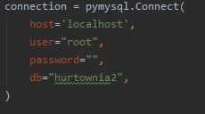

# Temat projektu
Przedmiotem projektu była Hurtownia. Postanowiliśmy stworzyć hurtownię wielobranżową. 
.

| Nazwisko i imię | Wydział | Kierunek | Semestr | Grupa | Rok akademicki |
| :-------------: | :-----: | :------: | :-----: | :---: | :------------: |
| Kamil Podwika         | WIMiIP  | IS       |   4     | 3     | 2019/2020      |
| Michał Serwaczak        | WIMiIP  | IS       |   4     | 3     | 2019/2020      |

## Projekt bazy danych

Baza danych składa się z ośmiu encji takich jak:
* Pracownik
* Klient
* Cena
* Produkt
* Stanowisko 
* Faktura
* Zamowienie
* Sekcja

Encje połączone są ze sobą przy pomocy kluczy obcych.


Przykładowe zapytania z grupy DDL:

Utworzenie tabeli cena
```sql
CREATE TABLE cena(
    id_cena int NOT NULL AUTO_INCREMENT PRIMARY KEY,
    cena double
    );
```
Utworzenie tabeli zamówienie
```sql
CREATE TABLE zamowienie(
    id_zamowienie int NOT NULL AUTO_INCREMENT PRIMARY KEY,
    id_produkt int,
    data_zamowienia date,
    id_pracownik int,
    ilosc int,
    id_faktura int
    );
```
Utworzenie tabeli klient
```sql
CREATE TABLE klient(
    id_klient int NOT NULL AUTO_INCREMENT PRIMARY KEY,
    imie varchar(50),
    nazwisko varchar(50),
    NIP varchar(10),
    k_login varchar(50),
    k_haslo varchar (50)
    );
```

Przykładowe zapytania modyfikujące strukturę tabelii
```sql
ALTER TABLE zamowienie ADD COLUMN klogin varchar(50);
```
```sql
ALTER TABLE faktura ADD FOREIGN KEY (id_klient) REFERENCES klient (id_klient);
```

## Implementacja zapytań SQL
Opracowaliśmy następujące funkcjonalności:
1. Wypisanie wszystkich produktów i posortowanie ich względem ceny malejąco
 ```sql
 SELECT produkt.nazwa_produktu, cena.cena FROM produkt 
 INNER JOIN cena ON cena.id_cena = produkt.id_cena 
 ORDER BY cena.cena DESC;
```

2. Dodanie nowo zatrudnionego pracownika, przykładowo:
```sql
INSERT INTO pracownik (id_pracownik, imie, nazwisko, pensja, id_stanowisko) 
VALUES (NULL, "przyklad_imie", "przyklad_nazwisko", 9999, (SELECT id_stanowisko FROM stanowisko where id_stanowisko=2));
```

3. Wystawienie faktury - najpierw dodajemy fakturę z pustą wartością faktury, następnie przypisujemy id faktury do zamówień, na końcu aktualizujemy wartość faktury. Wartość obliczana jest w pętli w czasie działania aplikacji.
```sql
INSERT INTO faktura (id_faktura, wartosc, id_klient) 
VALUES (NULL, NULL, (SELECT id_klient FROM klient WHERE k_login LIKE "kjan"));

UPDATE zamowienie SET id_faktura = (SELECT MAX(id_faktura) 
FROM faktura) WHERE id_faktura IS NULL AND klogin LIKE "kjan";

UPDATE faktura SET wartosc = 95 WHERE id_faktura = (SELECT MAX(id_faktura) FROM faktura);
```

4. Zaktualizowanie ceny, przykładowo zwiększamy cenę Jacuzzio o 1000:
```sql
UPDATE cena SET cena.cena = cena.cena + 1000 
WHERE id_cena = (SELECT id_cena FROM produkt 
WHERE nazwa_produktu LIKE Jacuzzi);
```

5. Wycofanie produktu ze sprzedaży, przykładowo wycofujemy Jacuzzi (usunięcie Jacuzzi z bazy danych):
```sql
DELETE FROM produkt WHERE nazwa_produktu LIKE "Jacuzzi";
```

6. Dodanie produktu do sprzedaży, przykładowo dodajemy do sprzedaży Jacuzzi warte 7000, sztuk 2. Jacuzzi ma znajdować się w sekcji ogrodniczej:
```sql
INSERT INTO produkt (id_produkt,id_cena, id_sekcja , nazwa_produktu, ilosc_produktow) 
VALUES (0, (SELECT id_cena FROM cena WHERE cena = 7000), (SELECT id_sekcja FROM sekcja WHERE sekcja LIKE "Ogrodnicza"), "Jacuzzi", 2);
```

7. Zaktualizowanie pensji pracownika - w zaprezentowanym przykładzie wzrost pensji o 100 dla użytkownika Krzysztof Krawczyk
```sql
UPDATE pracownik 
SET pensja = pensja + 100 
WHERE imie LIKE "Krzysztof" AND nazwisko LIKE "Krawczyk";
```

8. Wypisanie ilości rodzajów produktów oraz sumaryczna ilość produktów w danej sekcji
```sql
SELECT COUNT(produkt.id_produkt) AS rodzaje,SUM(produkt.ilosc_produktow) as produkty, sekcja.sekcja 
FROM produkt 
INNER JOIN sekcja ON produkt.id_sekcja = sekcja.id_sekcja GROUP BY sekcja;
```

9. Rejestracja klienta
```sql
INSERT INTO klient (id_klient, imie, nazwisko, NIP) 
VALUES (NULL, "przyklad", "przyklad", "9999999999");
```

10. Wypisanie wszystkich pracowników sortujac ich według stanowiska (sortowanie następuje alfabetycznie)
```sql
SELECT stanowisko.stanowisko, pracownik.imie, pracownik.nazwisko FROM pracownik 
INNER JOIN stanowisko ON pracownik.id_stanowisko = stanowisko.id_stanowisko 
ORDER BY stanowisko.stanowisko DESC;
```

11. Wyszukanie produktu po nazwie, przykładowo kilent chce wyszukać Jacuzzi
```sql
SELECT produkt.nazwa_produktu, cena.cena FROM produkt 
INNER JOIN cena ON produkt.id_cena = cena.id_cena 
WHERE nazwa_produktu LIKE "Jacuzzi";
```

12. Wypisanie wszystkich produktów wraz z ich ilością
```sql
SELECT nazwa_produktu, ilosc_produktow FROM produkt;
```

13. Aktualizacja ilości produktów - w przykładzie zwiększenie ceny Jacuzzi o 2000
```sql
UPDATE produkt 
SET produkt.ilosc_produktow = produkt.ilosc_produktow + 2000 
WHERE id_produkt = (SELECT id_produkt FROM produkt WHERE nazwa_produktu LIKE Jacuzzi);
```

14. Złożenie zamówienia - początkowo tworzymy zamówienie, następnie zmniejszamy ilość produktów o kupioną ilość. W przykładzie Klient zamówił 1 Jacuzzi, dlatego ich dostępna ilość została zmniejszona o 1.
```sql
INSERT INTO zamowienie (id_zamowienie,id_produkt, data_zamowienia, id_pracownik, ilosc, id_faktura) 
VALUES (NULL, (SELECT id_produkt FROM produkt WHERE nazwa_produktu LIKE Jacuzzi), "2020-05-27", 11, 1, NULL);

UPDATE produkt 
SET produkt.ilosc_produktow = produkt.ilosc_produktow - 1 
WHERE id_produkt = (SELECT id_produkt FROM produkt WHERE nazwa_produktu LIKE Jacuzzi);
```

15. Przydzielenie zadań - polega na przydzieleniu konkretnego zamówienia pracownikowi do wykonania. 
```sql
UPDATE zamowienie 
SET id_pracownik = (SELECT id_pracownik FROM pracownik 
WHERE imie LIKE Jacek AND nazwisko LIKE Placek) WHERE id_zamowienie = 1;
```

16. Wyświetlenie zamówień
```sql
SELECT zamowienie.id_zamowienie, produkt.nazwa_produktu, zamowienie.data_zamowienia, pracownik.imie, pracownik.nazwisko, zamowienie.ilosc FROM zamowienie 
INNER JOIN produkt ON zamowienie.id_produkt = produkt.id_produkt INNER JOIN pracownik ON zamowienie.id_pracownik = pracownik.id_pracownik;
```

17. Wypisanie faktury - klient chce obejrzeć wszystkie swoje faktury, wyświetlają mu się one w wersji skróconej. Jeśli chce zobaczyć szczegóły jednej z nich musi wprowadzić jej numer id.
```sql
SELECT id_faktura, wartosc FROM faktura 
WHERE id_klient = (SELECT id_klient FROM zamowienie WHERE klogin like "kjan" LIMIT 1);

SELECT produkt.nazwa_produktu, zamowienie.ilosc, cena.cena FROM zamowienie 
INNER JOIN produkt ON zamowienie.id_produkt = produkt.id_produkt 
INNER JOIN cena ON produkt.id_cena = cena.id_cena 
WHERE zamowienie.id_faktura = 4;

SELECT wartosc FROM faktura WHERE id_faktura = 4; 
```
18. Wypisanie wszystkich faktur dla kasjera.
```sql
SELECT faktura.id_faktura, faktura.wartosc, klient.k_login FROM faktura INNER JOIN klient ON klient.id_klient = faktura.id_faktura;
```

## Aplikacja
Aplikacja została napisana w języku Python. Połączenie z bazą danych zrealizowano poprzez:



W aplikacji został stworzony zarówno interfejs pracownika hurtownni, jak i klienta. Pracownik w zależności od stanowiska posiada różną ilość czynności którą może wykonać w hurtowni np: zaktualizowanie ceny, zaktualizowanie ilości produktu (w zamyśle chodzi o dostawę produktu do magazynu), przydzielenie zadań itp.
Klient ma możliwość zamówienia produktu, zobaczenia swoich faktur itp.

Interakcja z użytkownikiem realizowana jest poprzez wprowadzanie różnych cyfr, w zależności od tego co chcemy dokonać. Przy niektórych funkcjonalnościach należy wpisać żądaną przez aplikację rzecz, np. przy składaniu zamówienia wpisujemy nazwę produktu.

Przykładowa implementacja funkcjonalności:

1. Rejestracja klienta - funkcja przyjmuje argumenty podane przez użytkownika z klawiatury. Następnie następuje sprawdzenie czy podany login nie jest już zajęty. Jeśli byłby zajęty to użytkownik proszony jest o ponowne wprowadzenie loginu. Jeśli wszystko zostało wykonane prawidłowo klient dodawany jest do bazy.
```py
#9 REJERSTRACJA KLIENTA
def rejestracja(imie, nazwisko, NIP, login, haslo):
    connection = pymysql.Connect(
        host='localhost',
        user="root",
        password="",
        db="hurtownia2",
    )

    cur = connection.cursor()
    pomoc = "SELECT k_login FROM klient;"
    cur.execute(pomoc)
    for row in cur.fetchall():
       if login == row[0]:
            print("Podany login jest już zajęty!")
            login1 = input("Podaj nowy login: ")
            return rejestracja(imie, nazwisko, NIP, login1, haslo)


    sql = "INSERT INTO klient (id_klient, imie, nazwisko, NIP, k_login, k_haslo) VALUES (NULL, %s, %s, %s, %s, %s);"

    cur.execute(sql, (imie, nazwisko, NIP, login, haslo))
    connection.commit()
    connection.close()
```
2. Wyszukanie produktu - funkcja przyjmuje jako argument nazwę produktu szukaną przez klienta. Wypisany zostaje produkt wraz z ceną.
```py
def nazwa_produkt(nazwa):
    connection = pymysql.connect(
        host='localhost',
        user="root",
        password="",
        db="hurtownia2",
    )
    cur = connection.cursor()

    sql = "SELECT produkt.nazwa_produktu, cena.cena FROM produkt INNER JOIN cena ON produkt.id_cena = cena.id_cena WHERE nazwa_produktu LIKE %s;"

    cur.execute(sql, nazwa)
    for row in cur.fetchall():
        print(row[0], "|", row[1])

    connection.close()
```
3. Wycofanie produktu ze sprzedaży - funkcja przyjmuje jako argument nazwę produktu podaną przez użytkownika. Produkt zostaje usunięty z bazy danych.
```py
def usuniecie_produktu(nazwa):
    connection = pymysql.Connect(
        host='localhost',
        user="root",
        password="",
        db="hurtownia2",
    )

    cur = connection.cursor()

    sql = "DELETE FROM produkt WHERE nazwa_produktu LIKE %s;"

    cur.execute(sql, nazwa)
    connection.commit()
    connection.close()
```

## Dodatkowe uwagi
Ponieważ ceny dodawane są w osobnej encji, przy dodawaniu produktu należy upewnić się, że dana cena istnieje w bazie.
